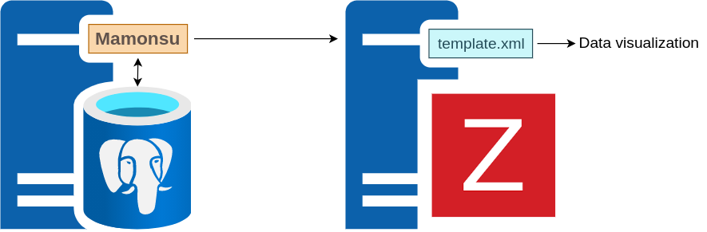
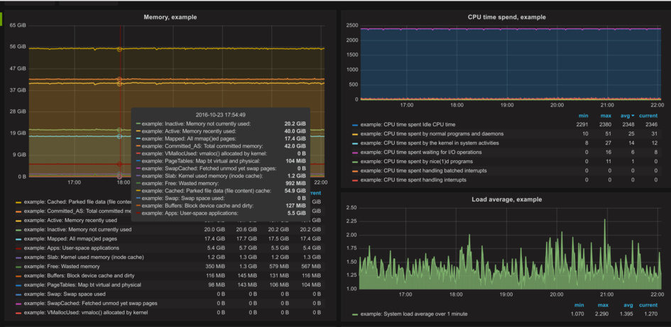
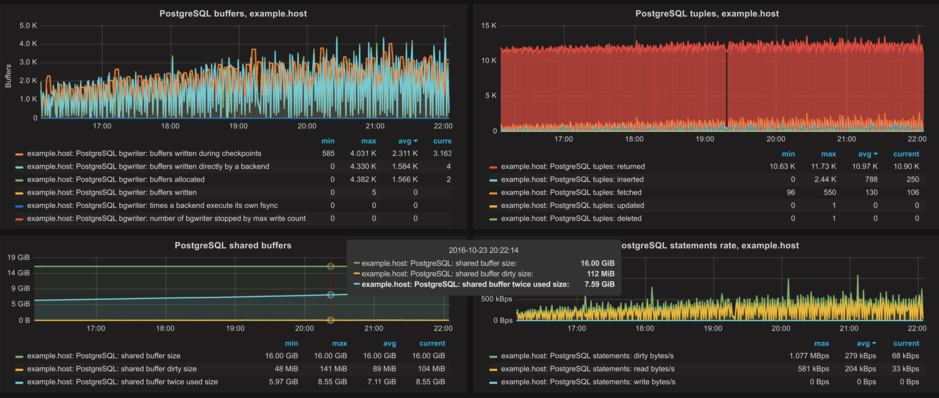

# Mamonsu: Monitoring agent for PostgreSQL
Mamonsu is an active agent for Zabbix collecting PostgreSQL instance and operating system metrics.
***
## Build status

***
## License
Development version, available on GitHub, released under BSD 3-clause.
***
## Compatibility
Supported platforms:
- Linux;
- FreeBSD;
- Windows;

Supported Zabbix server versions: 3.0 - 5.4  
Supported PostgreSQL versions: 9.5 - 14 
***

***Table of Contents***
- [Mamonsu: concepts](#mamonsu-concepts)
- [Requirements](#requirements)
- [Features](#features)
  - [Metrics](#metrics)
  - [Zabbix Screens](#zabbix-screens)
  - [Tools](#tools)
- [Build](#build)
- [Installation](#installation)
- [Usage](#usage)
  - [Screenshots](#screenshots)
  - [Configuration](#configuration)
  - [Template creation and upload](#template-creation-and-upload)
  - [Run](#run)
  - [Template update](#template-update)
  - [Best practices](#best-practices)
- [Additional chapters](#additional-chapters)

## Mamonsu: concepts
Based by zabbix, Mamonsu provides an extensible cross-platform solution that can collect and visualize multiple PostgreSQL and system metrics. Mamonsu has about 100 PostgreSQL metrics and about 30 system metrics. Mamonsu collects [metrics](documentation/metrics.md) such as database availability, number of connections, locks, WAL problems, checkpoints, background writer activity, memory problems and many others. Unlike the native Zabbix Agent configured to collect PostgreSQL metrics, Mamonsu uses a single database connection, which minimizes performance impact on the monitored system. Mamonsu also contains a number of [tools](documentation/tools.md) for interacting with the Zabbix API, obtaining system information and information about collected metrics.    
Mamonsu is written entirely in Python and has a plugin architecture. It is an active agent, which means that it sends the data to the Zabbix server once it is collected. Pre-configured to monitor multiple PostgreSQL and system metrics out of the box, Mamonsu can be extended with your own [custom plugins](documentation/adding_custom_plugins.md) to track other metrics critical for your system.  
Mamonsu can be installed on the same server where the DBMS we are going to watch is located or on remote server, but:  
> **_NOTE:_**  While Mamonsu can collect PostgreSQL metrics from a remote server, system metrics are only collected locally. If you choose to collect PostgreSQL metrics remotely, make sure to disable collection of system metrics to avoid confusion, as they will be displayed under the same host in Zabbix.
 
A template generated by Mamonsu must be bound to the Zabbix host to receive and display metrics.  

  

Mamonsu can be easily customized. You can configure such parameters as the data collection interval for each plugin (by default it is 60 seconds), the size of the message queue for the Zabbix server, optionally disable/enable various components.

## Requirements
Only Python3 and any text editor.

## Features
### Metrics
Mamonsu by default has 3 plugin groups and all of them are active:
- **common:** Mamonsu own metrics such as availability, plugin errors;
- **system:** contains *nix and windows metric sets. For example, on UNIX-based platforms you can collect specific metrics such as load average, open files count, CPU nice/idle/system time, etc.;
- **pgsql:** PostgreSQL specific metrics;

Mamonsu not only collects metrics, but provides triggers and graphs.     
See details in chapter called "[Metrics](documentation/metrics.md)".
### Zabbix Screens
Since Mamonsu **3.0** template contains screens:
- Overview  
  Contains graphs representing general important metrics: PostgreSQL connections, shared buffers size and usage, autovacuum, tuples, checkpoint, background worker, system CPU and memory.  

- PostgreSQL Instance  
  Contains information about Instance availability  

- PostgreSQL Locks

- PostgreSQL Transactions   

- PostgreSQL WAL  
  Contains information about WAL size, archiving  

- System  
  Contains information about state of the system

### Tools
Mamonsu provides the command-line interface for updating some Zabbix server settings, as well as getting an overview of the monitored system configuration and tuning PostgreSQL and system settings on the fly. Also it provides tool to generate a detailed report on the hardware, operating system, memory usage and other parameters of the monitored system. List of Mamonsu commands and options:  

    mamonsu agent [agent_action]  
    mamonsu bootstrap [-M mamonsu_user] [-x | --create-extensions] [connection_options]  
    mamonsu export {template | config} filename [export_options]  
    mamonsu report [report_options] [connection_options]  
    mamonsu tune [tuning_options] [connection_options]  
    mamonsu upload [upload_options]  
    mamonsu zabbix {template | host | hostgroup} server_action  
    mamonsu zabbix item {error | lastvalue | lastclock} host_id  
    mamonsu zabbix version  
    mamonsu --version  
    mamonsu --help

For all details, see the chapter called “[Tools](documentation/tools.md)".
## Build
**Build deb:**
```shell
$ apt-get install make dpkg-dev debhelper python3-dev python3-setuptools
$ git clone ... && cd mamonsu && make deb && dpkg -i mamonsu*.deb
```  
**Build rpm:**  
```shell
$ yum install make rpm-build python3-devel python3-setuptools
$ git clone ... && cd mamonsu && make rpm && rpm -i mamonsu*.rpm
```  
**Build repository, *./packaging/repo/gnupg* and *./packaging/repo/rpmmacros* must be provided by caller:**  
```shell
$ make -j2 build/all && make -j1 repo/all
```
**Build win32 exe:**  
```shell
$ git clone ... && cd mamonsu && python setup_win32.py py2exe
$ cp dist\{mamonsu, service_win32}.exe c:\mamonsu
$ c:\mamonsu\mamonsu.exe -w c:\mamonsu\agent.conf
$ c:\mamonsu\service_win32.exe -install
$ net start mamonsu
```
or
```shell
$ pyinstaller --onefile mamonsu_win32.spec
$ pyinstaller --onefile service_win32.spec
```  
**Build nsis installer:**  
```shell
$ git clone ... && cd mamonsu && python setup_win32.py py2exe
$ nsis packaging/win/mamonsu.nsis
```

## Installation
To use Mamonsu, you must create a Zabbix account and set up a Zabbix server as explained in [Zabbix documentation](https://www.zabbix.com/documentation/current/). Naturally, you must also have a PostgreSQL instance up and running if you are going to monitor PostgreSQL metrics.  
A pre-built Mamonsu package is provided in official Postgres Pro repository.  
**For Debian, Ubuntu, Astra:**  
```shell
$ wget  https://repo.postgrespro.ru/mamonsu/keys/apt-repo-add.sh
$ sudo chmod 700 ./apt-repo-add.sh
$ sudo ./apt-repo-add.sh
$ apt-get install mamonsu
```   
**For RPM-based distros such as Centos, RHEL, Oraclelinux, SLES, AltLinux, AltLinux-spt:**  
Install rpm from https://repo.postgrespro.ru/mamonsu/keys adding name of specific distro such as:
```shell
$ rpm -i https://repo.postgrespro.ru/mamonsu/keys/centos.rpm
```
Install package   
- for RH-like:  
  ```shell
  $ yum install mamonsu
  ```  
- for SLES:
  ```shell
  $ zypper install mamonsu
  ```  
- for AltLinux, AltlLinux-spt:
  ```shell
  $ apt-get update
  $ apt-get install mamonsu
  ```  
**For Windows:**  
Pre-Build packages for Windows: [Windows installer](https://repo.postgrespro.ru/mamonsu/win/)  

**Build and install from source code:**
```shell
git clone ... && cd mamonsu && python3 setup.py build && python3 setup.py install
```  

## Usage
### Screenshots

<div style="text-align: center">
  <p style="display: inline;">
    <a href="examples/statistics-1.png">
      
    </a>
    <a href="examples/statistics-2.png">
      
    </a>
    <a href="examples/statistics-3.png">
      
    </a>
  </p>
</div>

### Configuration
1. **Optionally, bootstrap Mamonsu**  
If you omit this step, metrics can only be collected on behalf of a superuser, which is not recommended.
   - Create a non-privileged database user for Mamonsu. For example:
   ```sql
   CREATE USER mamonsu_user WITH PASSWORD 'mamonsu_password';
   ```
   - Create a database that will be used for connection to PostgreSQL. For example:  
   ```sql
   CREATE DATABASE mamonsu_database OWNER mamonsu_user;
   ```  
   - Run the following command to bootstrap Mamonsu:
    ```shell
    mamonsu bootstrap [-M mamonsu_user] [-x | --create-extensions] [connection_options]
    ```
    For details of usage, see “[Tools](documentation/tools.md#bootstrap)".  
As the result of this operation, monitoring functions are created in the mamonsu_database in *mamonsu* schema, and the right to execute them is granted to the mamonsu_user. Thus, a superuser connection is no longer required. Mamonsu also creates several tables in the specified database. Do not delete these tables as they are required for Mamonsu to work.  
2. **Configure Mamonsu**  
    Edit the agent.conf configuration file.    
    Configure Zabbix-related settings. The address field must point to the running Zabbix server, while the client field must provide the name of the Zabbix host. You can find the list of hosts available for your account in the Zabbix web interface under Configuration > Hosts.    
    ```editorconfig
    [zabbix]
    ; enabled by default
    enabled = True
    client = zabbix_host_name
    address = zabbix_server
    ```  
    By default, Mamonsu will collect both PostgreSQL and system metrics. If required, you can disable metrics collection of either type by setting the enabled parameter to False in the [postgres] or [system] section of the agent.conf file, respectively.  
    ```editorconfig
    [system]
    ; enabled by default
    enabled = True
    ```  
    If you are going to collect PostgreSQL metrics, specify connection parameters for the PostgreSQL server you are going to monitor. In the user, password and database fields, you must specify the mamonsu_user, mamonsu_password and the mamonsu_database used for bootstrap, respectively. If you skipped the bootstrap, specify a superuser credentials and the database to connect to.  
    > **_NOTE:_** Mamonsu stores passwords as plain text in its configuration file, so control access to this file.  
    ```editorconfig
    [postgres]
    ; enabled by default
    enabled = True
    user = mamonsu_user
    database = mamonsu_database
    password = mamonsu_password
    port = 5432  
    ```  
   These are the main Mamonsu settings to get started. You can also fine-tune other Mamonsu settings as explained in the chapter called "[Configuration file](documentation/configuration_file.md)".  
### Template creation and upload  
1. **Generate a template** that defines how to visualize collected metrics on the Zabbix server:  
    ```shell
    mamonsu export template template.xml
    ```  
    Mamonsu generates the template.xml file in your current directory. By default, the name of the template that will be displayed in the Zabbix account is *Mamonsu PostgreSQL OS*, where *OS* is the name of your operating system. To get a template with a different display name, you can run the above command with the *--template-name* option.    
2. **Optionally, specify your Zabbix account settings** in the following environment variables on your monitoring system:  
   - Set the ZABBIX_USER and ZABBIX_PASSWD variables to the login and password of your Zabbix account, respectively.
   - Set the ZABBIX_URL to http://zabbix/
   
    If you skip this step, you will have to add the following options to all mamonsu zabbix commands that you run:  
    ```shell
    --url=http://zabbix/ --user=zabbix_login --password=zabbix_password
    ```  
3. **Upload the template.xml to the Zabbix server**
    ```shell
    mamonsu zabbix template export template.xml
    ```  
    Alternatively, you can upload the template through the Zabbix web interface: log in to your Zabbix account and select Templates > Import.

4. **Link the generated template to the host to be monitored**  
In the Zabbix web interface, select your host, go to Templates > Add, select your template, and click Update. If you would like to link a template with a new Zabbix host, you can do it from the command line using mamonsu zabbix commands. See the section called "[Zabbix cli](documentation/tools.md#zabbix-cli)" for details.  
### Run
On UNIX-like systems:
```shell
$ service mamonsu start
```
or by hand:
```shell
$ mamonsu -d -a /etc/mamonsu/plugins -c /etc/mamonsu/agent.conf -p /var/run/mamonsu.pid
```
### Template update
In order to correctly update the template after minor update and save all the data, it is necessary to generate the same template and application names. You can find your current template name in the Zabbix web interface under Configuration > Templates and application name in Configuration > Templates > Applications.  
After getting current template and application names, you should generate template like this:  
```shell
mamonsu export template template.xml --template-name="CURRENT_TEMPLATE_NAME" --application="CURRENT_APPLICATION_NAME"
```
Next, upload new template to the Zabbix server. You can do it via command line interface:  
```shell
mamonsu zabbix template export template.xml
```
Or through the Zabbix web interface:  
> **_NOTE:_**  While uploading through the Zabbix web interface, you must set *Delete missing* parameter to true for Value mappings, Template dashboards, Items, Discovery rules, Triggers and Graphs.  

  

### Best practices
  
**Zabbix host setup only with mamonsu zabbix cli**
1. Generate a template
    ```shell
    mamonsu export template template.xml
    ```
2. Set zabbix variables
    ```shell
    export ZABBIX_USER=Admin
    export ZABBIX_PASSWD=zabbix
    export ZABBIX_URL=http://zabbix/
    ```
3. Upload template
    ```shell
    mamonsu zabbix template export template.xml
    ```
4. Create host and link template
    ```shell
    mamonsu zabbix host create "pg-host" $(mamonsu zabbix hostgroup id "Linux Servers") $(mamonsu zabbix template id "Mamonsu PostgreSQL Linux") "10.10.0.4"
    ```
   This snippet shows how to create Zabbix host called "pg-host" with Mamonsu template in hostgroup "Linux Servers" with address 10.10.0.4.
 
**Mamonsu setup with remote PostgreSQL**
1. Generate and upload template  
    ```shell
    mamonsu export template template.xml; mamonsu zabbix template export template.xml 
    ```
2. Add remote PostgreSQL host
   ```shell
    mamonsu zabbix host create "remote-pg-1" $(mamonsu zabbix hostgroup id "Linux servers") $(mamonsu zabbix template id "Mamonsu PostgreSQL Linux") "45.45.200.5"
    ```
3. Setup agent.conf
   ```editorconfig
    [postgres]
    enabled = True
    user = mamonsu
    password = mamonsu
    database = postgres
    host = 45.45.200.5
    port = 5432
    application_name = mamonsu
    query_timeout = 10
    
    [zabbix]
    enabled = True
    client = remote-pg-1
    address = 127.0.0.1
    port = 10051
    re_send = False
    ```

**Mamonsu setup with remote PostgreSQL via SSH tunnel**
1. Generate and upload template  
    ```shell
    mamonsu export template template.xml; mamonsu zabbix template export template.xml 
    ```
2. Add remote PostgreSQL host
   ```shell
    mamonsu zabbix host create "remote-pg-1" $(mamonsu zabbix hostgroup id "Linux servers") $(mamonsu zabbix template id "Mamonsu PostgreSQL Linux") "45.45.200.5"
    ```
3. Setup SSH tunnel
    ```shell
    ssh -L 63333:localhost:5432 user@45.45.200.5
    ```
4. Setup agent.conf
   ```editorconfig
    [postgres]
    enabled = True
    user = mamonsu
    password = mamonsu
    database = postgres
    host = localhost
    port = 63333
    application_name = mamonsu
    query_timeout = 10
    
    [zabbix]
    enabled = True
    client = remote-pg-1
    address = 127.0.0.1
    port = 10051
    re_send = False
    ```
   
## Additional chapters
- [**Adding custom plugins**](documentation/adding_custom_plugins.md)
- [**Configuration file**](documentation/configuration_file.md)
- [**Metrics**](documentation/metrics.md)
- [**Tools**](documentation/tools.md)
