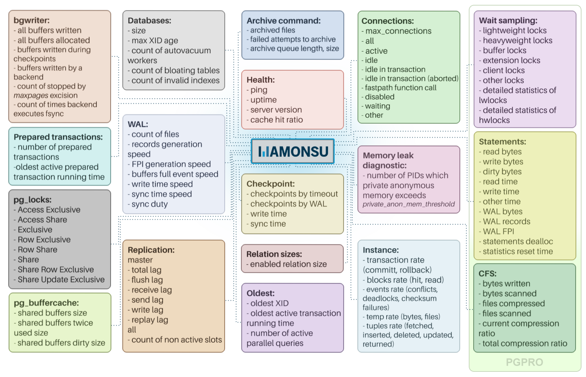
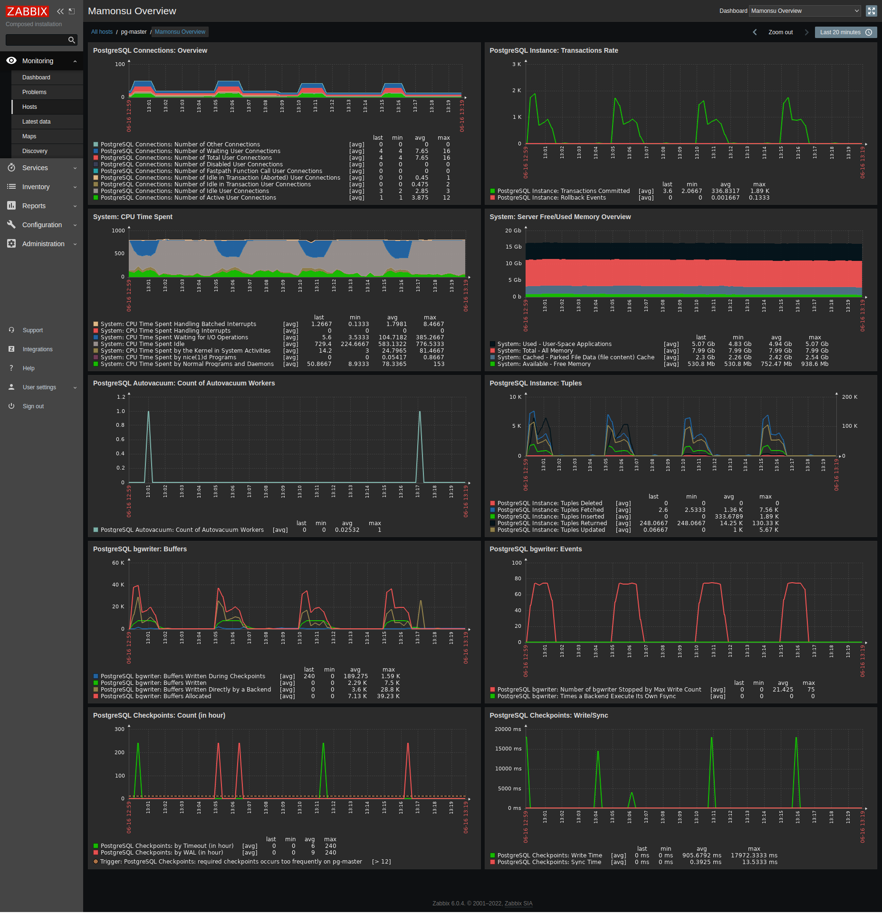
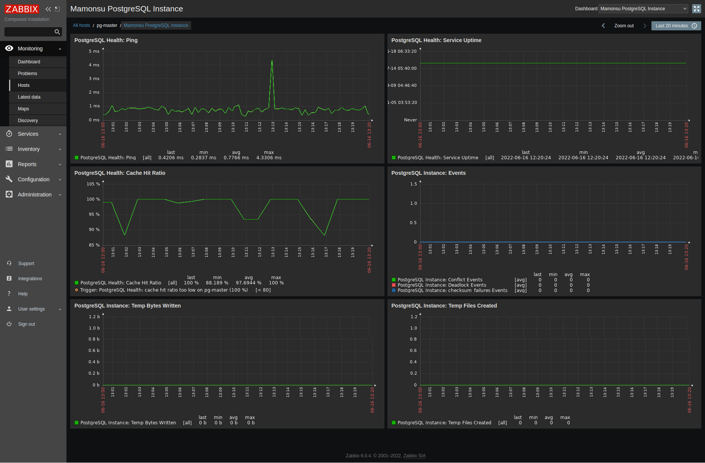
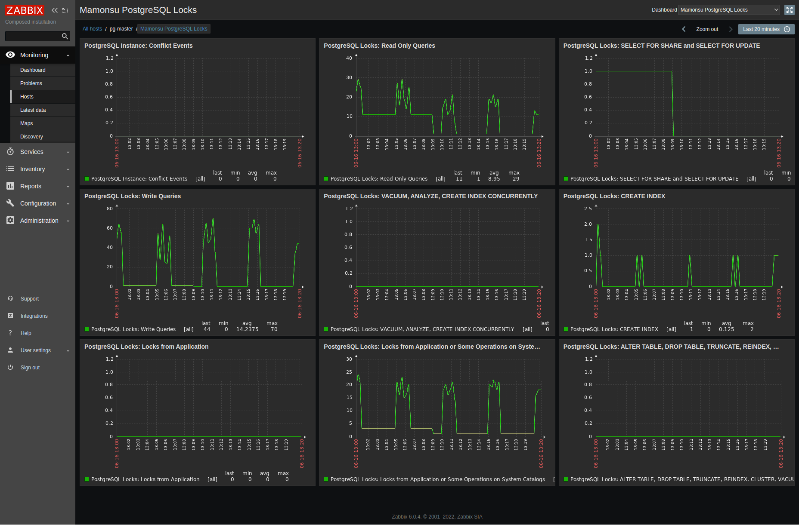
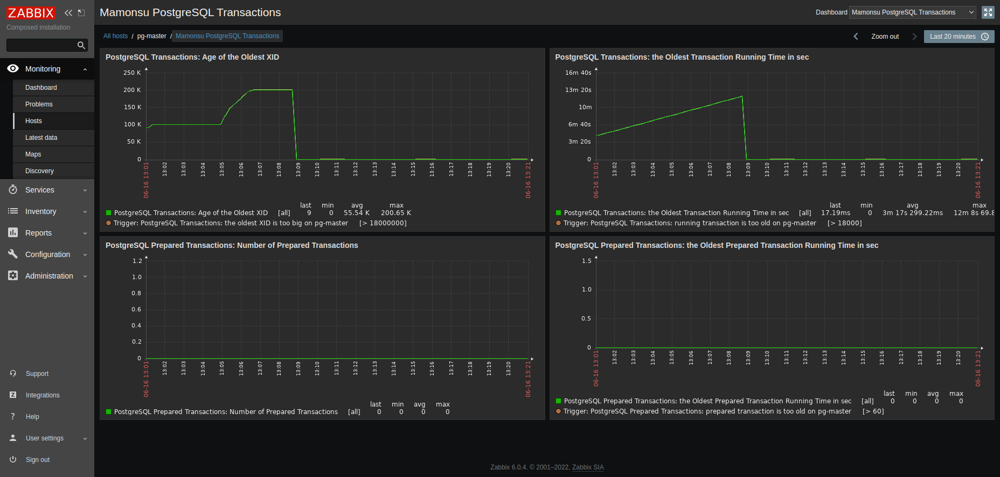
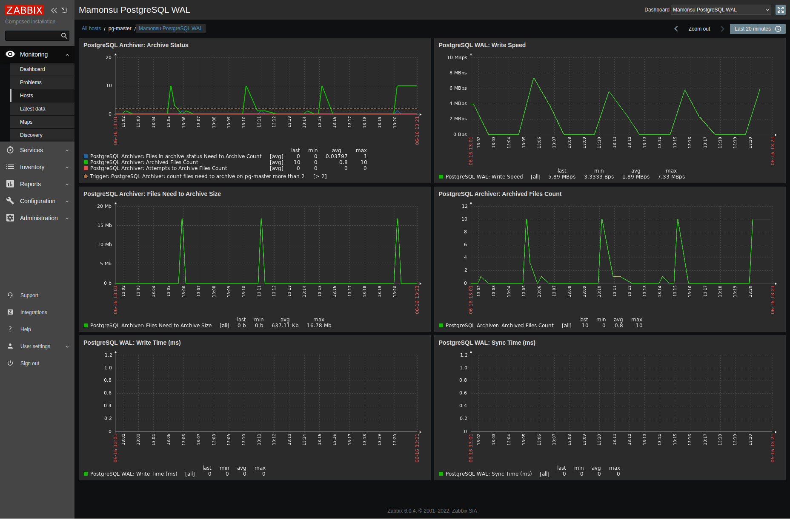
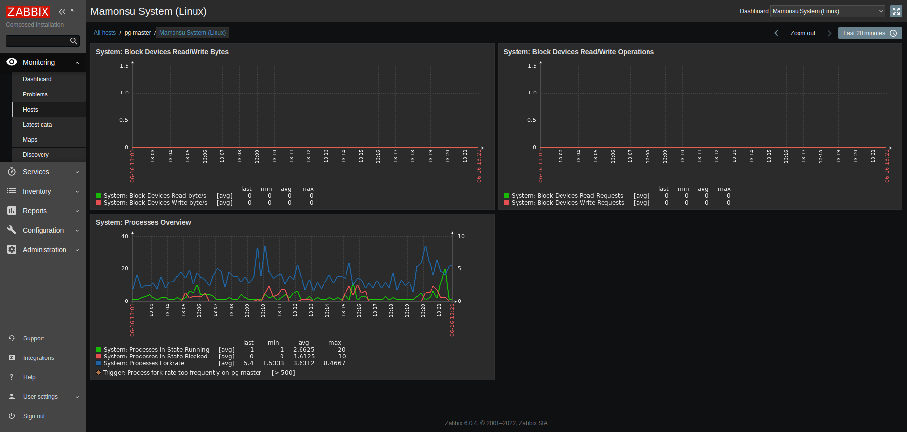
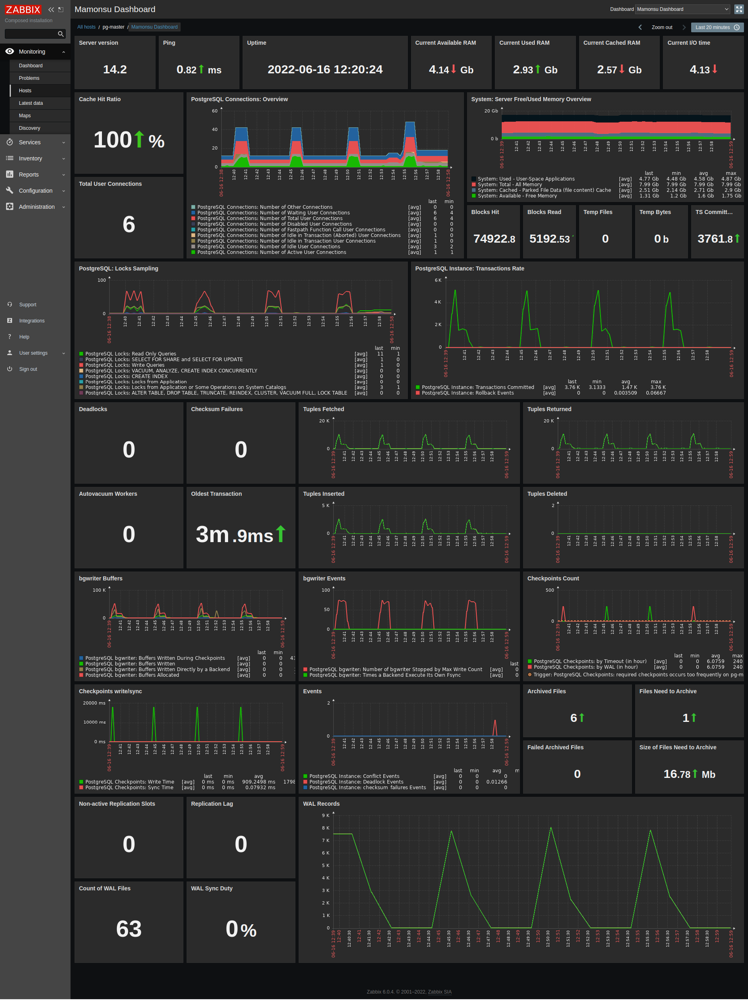
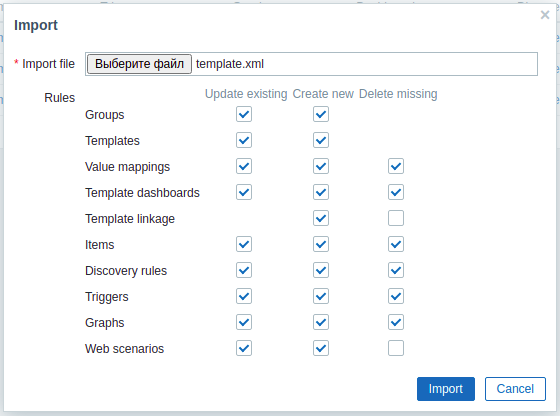

# mamonsu: monitoring agent for PostgreSQL
_mamonsu_ is an active agent for collecting PostgreSQL instance and operating system metrics that can interact with Zabbix.
***
## Build status


***
## License
Development version, available on GitHub, released under BSD 3-clause.
***
## Compatibility
Python 3.3+  

Supported platforms:
- Linux;
- FreeBSD;
- Windows;

Supported Zabbix server versions: 4.0.44 - 6.4.13
Supported PostgreSQL versions: 12 - 16
***

***Table of Contents***
- [mamonsu: concepts](#mamonsu-concepts)
- [Requirements](#requirements)
- [Features](#features)
  - [Metrics](#metrics)
  - [Zabbix Screens](#zabbix-screens)
  - [Tools](#tools)
- [Build](#build)
- [Installation](#installation)
- [Usage](#usage)
  - [Configuration](#configuration)
  - [Template creation and upload](#template-creation-and-upload)
  - [Run](#run)
  - [Template update](#template-update)
  - [Best practices](#best-practices)
- [Additional chapters](#additional-chapters)

## mamonsu: concepts
Based by Zabbix, _mamonsu_ provides an extensible cross-platform solution that can collect and visualize multiple PostgreSQL/PostgresPro and system metrics. _mamonsu_ has about 90 PostgreSQL metrics and about 40 system metrics. The agent collects [metrics](documentation/metrics.md) such as database availability, number of connections, locks, WAL problems, checkpoints, background writer activity, memory problems and many others. Unlike many monitoring agents configured to collect PostgreSQL metrics, _mamonsu_ uses a single database connection, which minimizes performance impact on the monitored system. _mamonsu_ also contains a number of [tools](documentation/tools.md) for interacting with the Zabbix API, obtaining system information and information about collected metrics.    
_mamonsu_ is written entirely in Python 3 and has a plugin architecture. It is an active agent, which means that it sends the data to the Zabbix server once it is collected. Pre-configured to monitor multiple PostgreSQL and system metrics out of the box, _mamonsu_ can be extended with your own [custom plugins](documentation/adding_custom_plugins.md) to track other metrics crucial for your system.  
_mamonsu_ can be installed on the same server where the DBMS we are going to monitor is located or on remote server, but:  
> **_NOTE:_**  While _mamonsu_ can collect PostgreSQL metrics from a remote server, system metrics are only collected locally. If you choose to collect PostgreSQL metrics remotely, make sure to disable collection of system metrics to avoid confusion, as they will be displayed under the same host in Zabbix.
 
A template generated by _mamonsu_ must be bound to the Zabbix host to receive and display metrics.

<p align="center">
    
</p>

_mamonsu_ can be easily customized. You can configure such parameters as the data collection interval for each plugin (by default it is 60 seconds), the size of the message queue for the Zabbix server, optionally disable/enable various components.

## Requirements
Only Python3.3+ and any text editor.

## Features
### Metrics
_mamonsu_ by default has 3 plugin groups and all of them are active:
- **common:** _mamonsu_ own metrics such as availability, plugin errors;
- **system:** contains *nix and windows metric sets. For example, on UNIX-based platforms you can collect specific metrics such as load average, open files count, CPU nice/idle/system time, etc.;
- **pgsql:** PostgreSQL/PostgresPro specific metrics;

<p align="center">
    
</p>

_mamonsu_ not only collects metrics, but provides triggers and graphs.     
See details in chapter called "[Metrics](documentation/metrics.md)".
### Zabbix Screens
Since _mamonsu_ **_3.0_** template contains screens:
- Overview  
  Contains graphs representing general important metrics: PostgreSQL connections, shared buffers size and usage, autovacuum, tuples, checkpoint, background worker, system CPU and memory.
    <details>
        <summary>Click to view</summary>
        
    </details>


- PostgreSQL Instance  
  Contains information about Instance availability
    <details>
        <summary>Click to view</summary>
        
    </details>


- PostgreSQL Locks
    <details>
        <summary>Click to view</summary>
        
    </details>


- PostgreSQL Transactions  
    <details>
        <summary>Click to view</summary>
        
    </details>


- PostgreSQL WAL  
  Contains information about WAL size, archiving
    <details>
        <summary>Click to view</summary>
        
    </details>


- System  
  Contains information about state of the system
    <details>
        <summary>Click to view</summary>
        
    </details>


- mamonsu Dashboard (*only for Zabbix 6.0+*)  
  Pretty dashboard containing all necessary PostgreSQL and system information.
    <details>
        <summary>Click to view</summary>
        
    </details>


### Tools
_mamonsu_ provides the command-line interface for updating some Zabbix server settings, as well as getting an overview of the monitored system configuration and tuning PostgreSQL and system settings on the fly. Also it provides tool to generate a detailed report on the hardware, operating system, memory usage and other parameters of the monitored system. List of _mamonsu_ commands and options:  

    mamonsu agent [agent_action] [-c | --config]  
    mamonsu bootstrap [-M mamonsu_user] [-x | --create-extensions] [-c | --config] [connection_options]  
    mamonsu export {template | config} filename [export_options]  
    mamonsu report [report_options] [connection_options]  
    mamonsu tune [tuning_options] [connection_options]  
    mamonsu upload [upload_options]  
    mamonsu zabbix {template | host | hostgroup} server_action  
    mamonsu zabbix item {error | lastvalue | lastclock} host_id  
    mamonsu zabbix dashboard upload [template_name]  
    mamonsu zabbix version  
    mamonsu --version  
    mamonsu --help

For all details, see the chapter called “[Tools](documentation/tools.md)".
## Build
**Build deb:**
```shell
$ apt-get install make dpkg-dev debhelper python3-dev python3-setuptools
$ git clone ... && cd mamonsu && make deb && dpkg -i mamonsu*.deb
```  
**Build rpm:**  
```shell
$ yum install make rpm-build python3-devel python3-setuptools
$ git clone ... && cd mamonsu && make rpm && rpm -i mamonsu*.rpm
```  
**Build win32 exe:**  
```shell
$ git clone ... && cd mamonsu && py setup_win32.py py2exe
$ copy dist\mamonsu.exe c:\mamonsu
$ copy dist\service_win32.exe c:\mamonsu
$ c:\mamonsu\mamonsu.exe -w c:\mamonsu\agent.conf
$ c:\mamonsu\service_win32.exe -install
$ net start mamonsu
```
or
```shell
$ pyinstaller --onefile mamonsu_win32.spec
$ pyinstaller --onefile service_win32.spec
```  
**Build NSIS installer:**  
```shell
$ git clone ... && cd mamonsu && py setup_win32.py py2exe
$ makensis packaging\win\mamonsu.nsis
```

## Installation
To use _mamonsu_, you must create a Zabbix account and set up a Zabbix server as explained in [Zabbix documentation](https://www.zabbix.com/documentation/current/). Naturally, you must also have a PostgreSQL instance up and running if you are going to monitor PostgreSQL metrics.  
Pre-built _mamonsu_ packages are provided in official Postgres Pro repository: [repo/mamonsu](https://repo.postgrespro.ru/mamonsu/)  

**Install from repository using script:**  
```shell
$ wget https://repo.postgrespro.ru/mamonsu/keys/pgpro-repo-add.sh
$ sudo chmod 700 ./pgpro-repo-add.sh
$ sudo ./pgpro-repo-add.sh
```   

Install package   
- for RH-like:  
  ```shell
  $ yum install mamonsu
  ```  
- for SLES:
  ```shell
  $ zypper install mamonsu
  ```  
- for Debian, Ubuntu, AltLinux, AltlLinux-spt:
  ```shell
  $ apt-get update
  $ apt-get install mamonsu
  ```  
**For Windows:**  
Pre-Build packages for Windows: [Windows installer](https://repo.postgrespro.ru/mamonsu/win/)  

**Build and install from source code:**
```shell
git clone ... && cd mamonsu && python3 setup.py build && python3 setup.py install
```  

## Usage
### Configuration
1. **Optionally, bootstrap _mamonsu_**  
If you omit this step, metrics can only be collected on behalf of a superuser, which is not recommended.
   - Create a non-privileged database user for _mamonsu_. For example:
   ```sql
   CREATE USER mamonsu_user WITH PASSWORD 'mamonsu_password';
   ```
   - Create a database that will be used for connection to PostgreSQL. For example:  
   ```sql
   CREATE DATABASE mamonsu_database OWNER mamonsu_user;
   ```  
   - Run the following command to bootstrap _mamonsu_:
    ```shell
    mamonsu bootstrap [-M mamonsu_user] [-x | --create-extensions] [-c | --config] [connection_options]
    ```
    For details of usage, see “[Tools](documentation/tools.md#bootstrap)".  
As the result of this operation, monitoring functions are created in the *mamonsu_database* in *mamonsu* schema, and the right to execute them is granted to the *mamonsu_user*. Thus, a superuser connection is no longer required. _mamonsu_ also creates several tables in the specified database. Do not delete these tables as they are required for _mamonsu_ to work.  
2. **Configure _mamonsu_**  
    Edit the *agent.conf* configuration file.    
    Configure Zabbix-related settings. The address field must point to the running Zabbix server, while the client field must provide the name of the Zabbix host. You can find the list of hosts available for your account in the Zabbix web interface under Configuration > Hosts.    
    ```editorconfig
    [zabbix]
    ; enabled by default
    enabled = True
    client = zabbix_host_name
    address = zabbix_server
    ```  
    By default, _mamonsu_ will collect both PostgreSQL and system metrics. If required, you can disable metrics collection of either type by setting the enabled parameter to False in the [postgres] or [system] section of the *agent.conf* file, respectively.  
    ```editorconfig
    [system]
    ; enabled by default
    enabled = True
    ```  
    If you are going to collect PostgreSQL metrics, specify connection parameters for the PostgreSQL server you are going to monitor. In the user, password and database fields, you must specify the *mamonsu_user*, *mamonsu_password* and the *mamonsu_database* used for `bootstrap`, respectively. If you skipped the `bootstrap`, specify a superuser credentials and the database to connect to.  
    > **_NOTE:_** _mamonsu_ stores passwords as plain text in its configuration file, so control access to this file. By default configuration file _agent.conf_ should have read/write permissions for _mamonsu_ user only.  
    ```editorconfig
    [postgres]
    ; enabled by default
    enabled = True
    user = mamonsu_user
    database = mamonsu_database
    password = mamonsu_password
    port = 5432  
    ```  
   These are the main _mamonsu_ settings to get started. You can also fine-tune other _mamonsu_ settings as explained in the chapter called "[Configuration file](documentation/configuration_file.md)".  
### Template creation and upload  
1. **Generate a template** that defines how to visualize collected metrics on the Zabbix server:  
    ```shell
    mamonsu export template template.xml
    ```  
    _mamonsu_ generates the *template.xml* file in your current directory. By default, the name of the template that will be displayed in the Zabbix account is *mamonsu PostgreSQL OS*, where *OS* is the name of your operating system. To get a template with a different display name, you can run the above command with the *--template-name* option.    
2. **Optionally, specify your Zabbix account settings** in the following environment variables on your monitoring system:  
   - Set the ZABBIX_USER and ZABBIX_PASSWD variables to the login and password of your Zabbix account, respectively.
   - Set the ZABBIX_URL to http://zabbix/
   
    If you skip this step, you will have to add the following options to all `mamonsu zabbix` commands that you run:  
    ```shell
    --url=http://zabbix/ --user=zabbix_login --password=zabbix_password
    ```  
3. **Upload the template.xml to the Zabbix server**
    ```shell
    mamonsu zabbix template export template.xml
    ```  
    Alternatively, you can upload the template through the Zabbix web interface: log in to your Zabbix account and select Templates > Import.

4. **Link the generated template to the host to be monitored**  
In the Zabbix web interface, select your host, go to Templates > Add, select your template, and click Update. If you would like to link a template with a new Zabbix host, you can do it from the command line using `mamonsu zabbix` commands. See the section called "[Zabbix cli](documentation/tools.md#zabbix-cli)" for details.  
### Run
On UNIX-like systems:
```shell
$ service mamonsu start
```
or by hand:
```shell
$ mamonsu -d -a /etc/mamonsu/plugins -c /etc/mamonsu/agent.conf -p /var/run/mamonsu.pid
```
### Template update
In order to correctly update the template after minor update and save all the data, it is necessary to generate the same template and application names. You can find your current template name in the Zabbix web interface under Configuration > Templates and application name in Configuration > Templates > Applications.  
After getting current template and application names, you should generate template like this:  
```shell
mamonsu export template template.xml --template-name="CURRENT_TEMPLATE_NAME" --application="CURRENT_APPLICATION_NAME"
```
Next, upload new template to the Zabbix server. You can do it via command line interface:  
```shell
mamonsu zabbix template export template.xml
```
Or through the Zabbix web interface:  
> **_NOTE:_**  While uploading through the Zabbix web interface, you must set *Delete missing* parameter to true for Value mappings, Template dashboards, Items, Discovery rules, Triggers and Graphs.  

<p align="center">
    
</p>

### Best practices
  
**Zabbix host setup only with `mamonsu zabbix` cli**
1. Generate a template
    ```shell
    mamonsu export template template.xml
    ```
2. Set Zabbix variables
    ```shell
    export ZABBIX_USER=Admin
    export ZABBIX_PASSWD=zabbix
    export ZABBIX_URL=http://zabbix/
    ```
3. Upload template
    ```shell
    mamonsu zabbix template export template.xml
    ```
4. Create host and link template
    ```shell
    mamonsu zabbix host create "pg-host" $(mamonsu zabbix hostgroup id "Linux Servers") $(mamonsu zabbix template id "mamonsu PostgreSQL Linux") "10.10.0.4"
    ```
   This snippet shows how to create Zabbix host called *pg-host* with mamonsu template in hostgroup *Linux Servers* with address *10.10.0.4*.
 
**_mamonsu_ setup with remote PostgreSQL**
1. Generate and upload template  
    ```shell
    mamonsu export template template.xml; mamonsu zabbix template export template.xml 
    ```
2. Add remote PostgreSQL host
   ```shell
    mamonsu zabbix host create "remote-pg-1" $(mamonsu zabbix hostgroup id "Linux servers") $(mamonsu zabbix template id "mamonsu PostgreSQL Linux") "45.45.200.5"
    ```
3. Setup agent.conf
   ```editorconfig
    [postgres]
    enabled = True
    user = mamonsu
    password = mamonsu
    database = postgres
    host = 45.45.200.5
    port = 5432
    application_name = mamonsu
    query_timeout = 10
    
    [zabbix]
    enabled = True
    client = remote-pg-1
    address = 127.0.0.1
    port = 10051
    re_send = False
    ```

**_mamonsu_ setup with remote PostgreSQL via SSH tunnel**
1. Generate and upload template  
    ```shell
    mamonsu export template template.xml; mamonsu zabbix template export template.xml 
    ```
2. Add remote PostgreSQL host
   ```shell
    mamonsu zabbix host create "remote-pg-1" $(mamonsu zabbix hostgroup id "Linux servers") $(mamonsu zabbix template id "mamonsu PostgreSQL Linux") "45.45.200.5"
    ```
3. Setup SSH tunnel
    ```shell
    ssh -L 63333:localhost:5432 user@45.45.200.5
    ```
4. Setup *agent.conf*
   ```editorconfig
    [postgres]
    enabled = True
    user = mamonsu
    password = mamonsu
    database = postgres
    host = localhost
    port = 63333
    application_name = mamonsu
    query_timeout = 10
    
    [zabbix]
    enabled = True
    client = remote-pg-1
    address = 127.0.0.1
    port = 10051
    re_send = False
    ```
   
**Major update**  
If you want to upgrade _mamonsu_ to a version that is not compatible with the previous one, what you must do to continue using the application depends on whether you need to retain the metrics data collected.  
If you do not need to retain the collected data, just unlink old template and link a new one.  

If you need to retain the collected data, do the following:

1. Install the new version of _mamonsu_.
2. Generate a new template for the Zabbix server.
3. If you performed a bootstrap using the previous version of _mamonsu_, run the bootstrap command again.
4. Upload the new template to the Zabbix server.
5. Rename the host for which you want to retain the collected data and leave the old template linked to that host.
6. Create a new host for the same system and link the new template to it.
7. Restart _mamonsu_. It will collect data for the new host. The old host will no longer be used, but the data collected will be available.  

The difficulty is that Zabbix cannot massively rename hosts.  
We offer the following recommendations:
1. If you have access to the Zabbix database:  
Mass rename hosts via SQL:
    ```shell
    zabbix=# SELECT host, name FROM hosts
    zabbix-# WHERE host LIKE '%local-pg%';
    -[ RECORD 1 ]----
    host | local-pg-2
    name | local-pg-2
    -[ RECORD 2 ]----
    host | local-pg-3
    name | local-pg-3
    
    zabbix=# UPDATE hosts
    zabbix=# SET host = host || ' OLD-mamonsu',
    zabbix=#     name = name || ' OLD-mamonsu'
    zabbix=# WHERE host LIKE '%local-pg%';
    UPDATE 2
    zabbix=# SELECT host, name FROM hosts
    zabbix=# WHERE host LIKE '%local-pg%';
    -[ RECORD 1 ]----------------
    host | local-pg-2 OLD-mamonsu
    name | local-pg-2 OLD-mamonsu
    -[ RECORD 2 ]----------------
    host | local-pg-3 OLD-mamonsu
    name | local-pg-3 OLD-mamonsu
    ```
2. Using Zabbix API:  
API query:
    ```shell
    curl -H "Content-type: application/json-rpc" -X POST http://zabbix/api_jsonrpc.php -d'
    {
        "jsonrpc": "2.0",
        "method": "host.update",
        "params": {
            "hostid": "HOST_ID",
            "host": "local-pg-3 OLD-mamonsu",
            "name": "local-pg-3 OLD-mamonsu"
        },
        "auth": "AUTH_TOKEN",
        "id": 1
    }'
    ```
   <details>
   <summary>Script</summary>
   
    ```shell
    #!/bin/bash
     
    ZABBIX_URL="http://zabbix/"
    ZABBIX_USER="Admin"
    ZABBIX_PASSWORD="zabbix"
    ZABBIX_PATTERN=""
    ZABBIX_SUFFIX="OLD"
     
    for parameter in "$@"
    do
    case $parameter in
        -u=*|--url=*) # zabbix url
        ZABBIX_URL="${parameter#*=}"
        shift
        ;;
        -U=*|--user=*) # zabbix user
        ZABBIX_USER="${parameter#*=}"
        shift
        ;;
        -P=*|--password=*) # zabbix password
        ZABBIX_PASSWORD="${parameter#*=}"
        shift
        ;;
        -p=*|--pattern=*) # zabbix host pattern
        ZABBIX_PATTERN="${parameter#*=}"
        shift
        ;;
        -s=*|--suffix=*) # zabbix host suffix
        ZABBIX_SUFFIX="${parameter#*=}"
        shift
        ;;
        *)
              # unknown option
        ;;
    esac
    done
     
    # get Zabbix auth token
    auth_token=$(curl -H "Content-type: application/json-rpc" -X POST ${ZABBIX_URL}api_jsonrpc.php -d'
    {
        "jsonrpc": "2.0",
        "method": "user.login",
        "params": {
        "user": "'${ZABBIX_USER}'",
        "password": "'${ZABBIX_PASSWORD}'"
        },
        "id": 1
    }' | python3 -c "import sys, json; print(json.load(sys.stdin)['result'])")
     
    # get array of Zabbix hosts to rename
    readarray -t hosts < <(mamonsu zabbix --url=${ZABBIX_URL} --user=${ZABBIX_USER} --password=${ZABBIX_PASSWORD} host list | awk '{ print "\""$0"\""}' | grep ${ZABBIX_PATTERN})
    hosts=("${hosts[@]//\"/}")
     
    hosts_dict={}
    # create dict from array (id:name)
    for host in "${hosts[@]}"
    do
        hosts_dict[$(mamonsu zabbix --url=${ZABBIX_URL} --user=${ZABBIX_USER} --password=${ZABBIX_PASSWORD} host id "${host}")]=$host
    done
     
    for key in "${!hosts_dict[@]}"; do
        if [ ${key} -ne 0 ]; then
        eval 'curl -H "Content-type: application/json-rpc" -X POST ${ZABBIX_URL}api_jsonrpc.php -d '\''
    {
        "jsonrpc": "2.0",
        "method": "host.update",
        "params": {
            "hostid": "'${key}'",
            "host": "'${hosts_dict[$key]}' '${ZABBIX_SUFFIX}'",
            "name": "'${hosts_dict[$key]}' '${ZABBIX_SUFFIX}'"
        },
        "auth": "'${auth_token}'",
        "id": 1
    }'\'''
        fi
    done
    ```
   
   </details>

    Script usage example:
    ```shell
    ./rename_zabbix_hosts.sh --url=http://localzabbix/ --pattern="local-pg" --suffix="OLD-mamonsu"
    ```
   
## Additional chapters
- [**Adding custom plugins**](documentation/adding_custom_plugins.md)
- [**Configuration file**](documentation/configuration_file.md)
- [**Metrics**](documentation/metrics.md)
- [**Tools**](documentation/tools.md)
